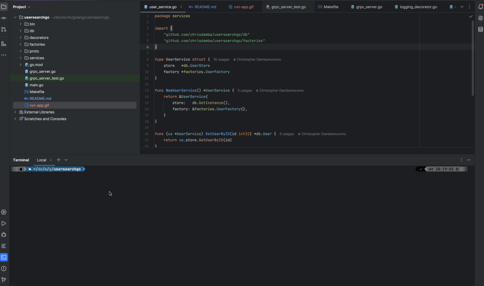

# UserSearchGo

UserSearchGo is a Golang gRPC service for managing user details and providing search capabilities based on various criteria such as city, phone number, and marital status. This project demonstrates the use of gRPC, Protocol Buffers, and Go design patterns for a clean and maintainable codebase.

## Features
- **gRPC Endpoints:**
    - `GetUser(UserID)`: Fetches a single user by ID.
    - `GetUsers(UserIDs)`: Fetches multiple users by their IDs.
    - `SearchUsers(SearchRequest)`: Searches for users based on criteria like name, city, phone, and marital status.
- **Data Storage:**
    - In-memory storage (for development/testing).
    - Easily extendable to support database backends (e.g., PostgreSQL).
- **Design Patterns:**
    - Repository pattern for data access abstraction.
    - TODO: Decorator pattern for adding cross-cutting concerns (logging, caching).
    - Factory pattern for constructing services.
    - Singleton pattern for in-memory data management (optional).
- **Testability:**
    - Comprehensive unit tests.

## Getting Started

## Installation

### Prerequisites

- Go 1.20+
- Protocol Buffers compiler (`protoc`)
- Go gRPC plugins

### Environment Setup

#### Mac

1. Install Go:

    ```sh
    brew install go
    ```

2. Install Protocol Buffers:

    ```sh
    brew install protobuf
    ```

3. Install Go gRPC plugins:

    ```sh
    go install google.golang.org/protobuf/cmd/protoc-gen-go@latest
    go install google.golang.org/grpc/cmd/protoc-gen-go-grpc@latest
    ```

#### Linux

1. Install Go:

    Follow the instructions at [golang.org](https://golang.org/doc/install) to install Go.

2. Install Protocol Buffers:

    ```sh
    sudo apt-get install -y protobuf-compiler
    ```

3. Install Go gRPC plugins:

    ```sh
    go install google.golang.org/protobuf/cmd/protoc-gen-go@latest
    go install google.golang.org/grpc/cmd/protoc-gen-go-grpc@latest
    ```

#### Windows

1. Install Go:

    Download and install Go from [golang.org](https://golang.org/dl/).

2. Install Protocol Buffers:

    Download and install the pre-compiled binaries from the [Protocol Buffers GitHub releases page](https://github.com/protocolbuffers/protobuf/releases).

3. Install Go gRPC plugins:

    ```sh
    go install google.golang.org/protobuf/cmd/protoc-gen-go@latest
    go install google.golang.org/grpc/cmd/protoc-gen-go-grpc@latest
    ```

### Project Setup

1. Clone the repository:

    ```sh
    git clone https://github.com/chrisdamba/usersearchgo.git
    cd usersearchgo
    ```

2. Install dependencies:

    ```sh
    go mod tidy
    ```

## Usage

### Building and Running the Server

To build and run the gRPC server:

```sh
make run
```

This will generate the necessary protobuf files, build the project, and start the gRPC server on port 50051.
You can use gRPC clients (e.g., `grpcurl`, custom Go clients) to interact with the service endpoints. Refer to the `user.proto` file for details on the request and response messages. Below is an example of how to use `grpcurl` to call the `GetUserById` method:

```sh
grpcurl -plaintext -d '{"id": 1}' localhost:50051 user.UserService/GetUserById
```

**Tip:** Consider using `evans`, a CLI tool for exploring and interacting with gRPC services. It will automatically generate and validate your request and response message.



### Running Tests

To run the unit tests:

```sh
make test
```

### Regenerating Protobuf Files

If you make changes to the `proto/user.proto` file, you can regenerate the Go files using:

```sh
make proto
```


## gRPC API

### User Service

#### GetUserById

Fetch user details based on user ID.

**Request:**

```protobuf
message UserIdRequest {
  int32 id = 1;
}
```

**Response:**

```protobuf
message UserResponse {
  User user = 1;
}
```

#### GetUsersByIds

Retrieve a list of user details based on a list of user IDs.

**Request:**

```protobuf
message UserListRequest {
  repeated int32 ids = 1;
}
```

**Response:**

```protobuf
message UserListResponse {
  repeated User users = 1;
}
```

#### SearchUsers

Search for user details based on specific criteria (e.g., city, phone number, marital status).

**Request:**

```protobuf
message UserSearchRequest {
  string fname = 1;
  string city = 2;
  string phone = 3;
  bool married = 4;
}
```

**Response:**

```protobuf
message UserListResponse {
  repeated User users = 1;
}
```


## License

This project is licensed under the MIT License. See the [LICENSE](LICENSE) file for details.
